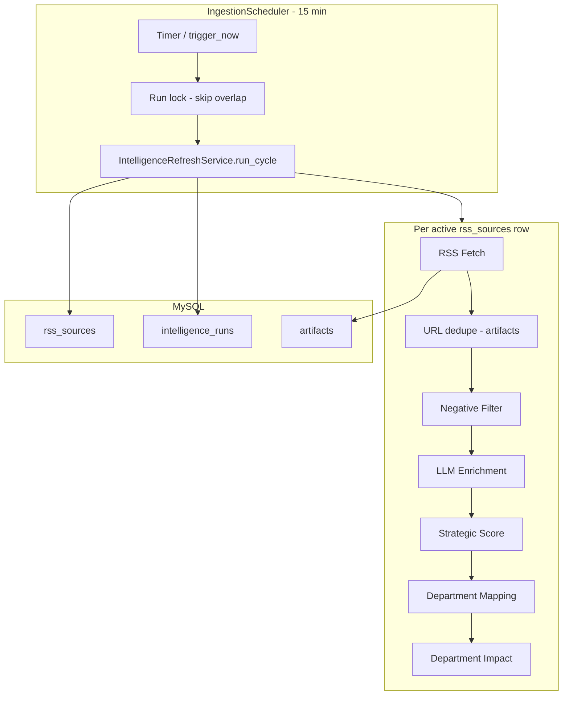

# Intelligence Refresh Scheduler (Phase 9)

## Purpose

Automated 15-minute intelligence refresh across all **active** RSS sources, with cycle-level monitoring exposed to operators and the dashboard.

---

## Scheduler Architecture



| Component | File | Role |
|-----------|------|------|
| `IngestionScheduler` | `ingest/scheduler.py` | Daemon thread; interval from `INGEST_SCHEDULER_INTERVAL_MINUTES` (default 15) |
| `IntelligenceRefreshService` | `ingest/intelligence_refresh.py` | One DB session per cycle; aggregates metrics |
| `SourceHealthMonitor` | `ingest/source_health.py` | Per-feed fetch health (`rss_source_runs`) |
| `scheduler_state` | `ingest/scheduler_state.py` | In-process last/next run for API |
| `ArtifactEnrichmentService` | `enrichment/service.py` | Unchanged pipeline through impact |

Inactive sources (`active_flag = 0`) are **not** polled.

---

## Pipeline (per article)

1. **RSS Source** — row from `rss_sources`
2. **Fetch** — `RssIngestionService` + cursor incremental read
3. **Deduplicate** — global normalized URL (`uq_artifacts_url`)
4. **Negative Filter** — `NegativeFilterService` (skip enrichment if matched)
5. **Enrichment** — LLM summary / classification
6. **Strategic Score** — `StrategicScorer`
7. **Department Mapping** — `DepartmentMappingService`
8. **Department Impact** — `DepartmentImpactGenerator` via mapper

---

## Database: `intelligence_runs`

| Column | Description |
|--------|-------------|
| `run_id` | UUID per cycle |
| `started_at` / `completed_at` | Cycle window |
| `sources_polled` | Active sources attempted |
| `articles_found` | RSS entries fetched |
| `articles_inserted` | New artifacts |
| `articles_filtered` | Negative filter skips |
| `articles_enriched` | Successful enrichments |
| `articles_scored` | Enrichments with `strategic_score` set |
| `status` | `running`, `success`, `partial`, `failure` |
| `error_message` | Fatal cycle error text |

Apply: `python backend/scripts/apply_schema.py` (includes `intelligence_runs.sql`).

---

## Monitoring Strategy

| Layer | Store | Use |
|-------|-------|-----|
| Cycle | `intelligence_runs` | Operator summary, `/v1/system/status` |
| Feed | `rss_source_runs` | Per-source fetch failures (Phase 8) |
| Source registry | `rss_sources.last_health_status` | Feed-level degraded/unhealthy |
| API health | `status` field | `healthy` / `degraded` / `unhealthy` |

**Health rules (`/v1/system/status`):**

- `unhealthy` — last cycle `failure` or DB unreachable
- `degraded` — last cycle `partial`, still running, or last success &gt; 1 hour ago
- `healthy` — last cycle `success` and recent

---

## API

### `GET /v1/system/status`

```json
{
  "status": "healthy",
  "last_run": "2026-06-03T10:15:00",
  "next_run": "2026-06-03T10:30:00",
  "active_sources": 19,
  "articles_today": 12,
  "last_run_summary": {
    "run_id": "...",
    "sources_polled": 19,
    "articles_found": 240,
    "articles_inserted": 3,
    "articles_filtered": 1,
    "articles_enriched": 2,
    "articles_scored": 2,
    "status": "success"
  }
}
```

---

## Frontend

Small `SyncStatusIndicator` in the dashboard header (no layout redesign):

- **● Live** (green / amber / red by status)
- **Last Sync**
- **Next Refresh**

Polls `/v1/system/status` every 60 seconds.

---

## Configuration

| Env | Default | Meaning |
|-----|---------|---------|
| `INGEST_SCHEDULER_INTERVAL_MINUTES` | `15` | Refresh interval |

---

## Related

- `docs/rss_source_registry.md` — Phase 8 feed registry
- `docs/negative_intelligence_filter.md` — filter stage
